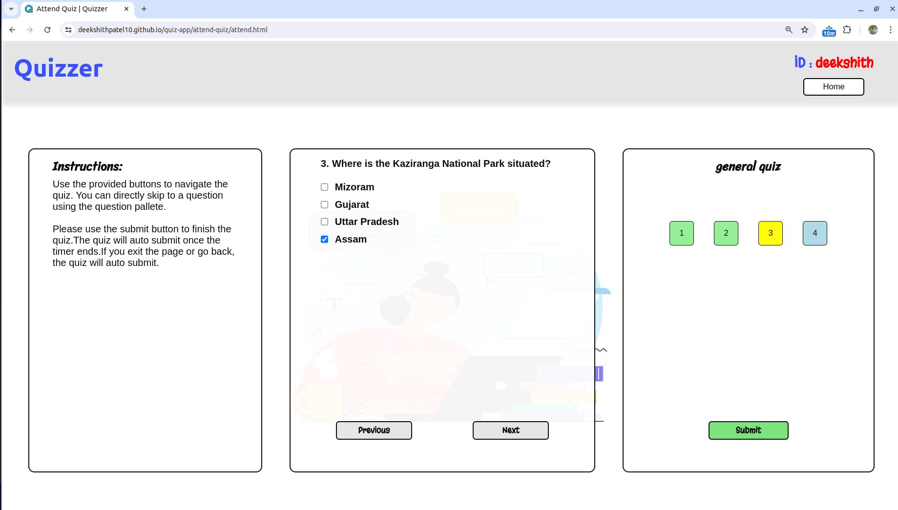
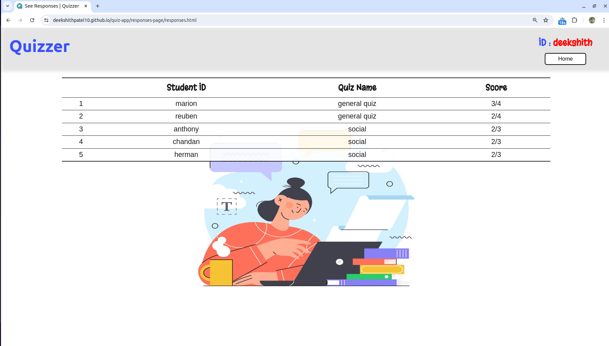

## Quizzer
Quizzer is a basic website to conduct or attend MCQ type quizzes. The site is built using HTML, CSS and vanilla JS. Firebase services is used to handle all backend functionalities.

<ol>To attend a sample quiz, use the following:
<li>Tutor ID: deekshith</li>
<li>Quiz Name: General Quiz</li>
</ol>

### Login Page
The login page prompts the user to enter their User ID and password to login. If they don't have an account, the user can create one by clicking on the *Create Account* button.

The user name and password are saved as attributes of a unique document in a collection of *Firestore Database*. When login is clicked, this document is fetched and the attributes are compared. If no document exists, a error is shown. 

A new document is created when Create Account is clicked. 

### Home Page
The Home Page of the website provides the users with four options.

 

Each div has an attached event listener that opens the respective page on click. 

### Create Quiz
Users can create a MCQ quiz from this page. The center div has four input areas for typing the question and four options. The last input is a dropdown to select the correct option. 

 

Users can delete previously saved questions. They can also review previous questions on clicking on them. 

Each question is an array, and is saved the as an attribute of a document. The whole quiz is saved as a document in the *Firestore Database*.

When a quiz is saved, a new document with all the details is created and saved. 

### Attend Quiz
Users can attend a quiz from the *Attend Quiz* page. The page first prompts the user to enter the *Tutor ID* and *Quiz name*. The corresponding quiz is then fetched and displayed. A error message is displayed if the quiz doesn't exist. 

 

Users can keep track of questions using the question pallete on the right. Unanswered questions are highlighted in blue. The current question is highlighted in yellow and answered questions turn green.

A confirm alert is displayed when the submit button is clicked. The site redirects to the home page when the user clicks "yes" on the alert. The result is saved as a document in the Firestore Database, with student name, tutor name, quiz name and score as attributes. 

### Check Responses
A tutor can check scores of the students who have attended the test from this page. 

 

On load, a query is run in the Firestore database collection of result documents, with tutor ID equal to user ID. All the returned documents are processed and displayed in a table. 

### See Results

Similarly, a student can check his results from this page. A query with student ID equal to user ID is run in this case. 

### Possible Improvements
<ol>
<li> A timer option can be provided to conduct timed quizzes. The quiz auto submits when the timer ends.
<li> Options to add numerical-answer and fill in the blank type questions can be added. 
<li> Option to change previously set answers to questions in a deployed quiz can be given. 
<li> Entire reponse sheet of a student can be made available to a tutor.
</ol>